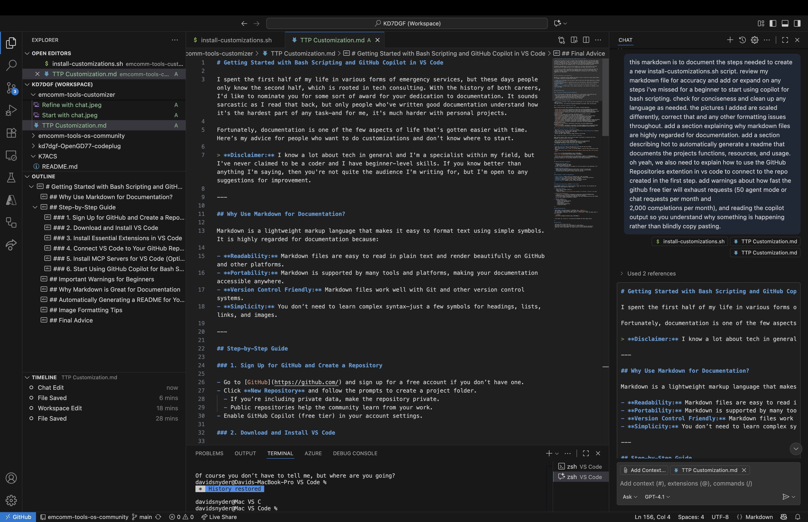

# Getting Started with Bash Scripting and GitHub Copilot

> **Disclaimer:** I know a lot about tech in general and I'm a specialist within my field, but I've never claimed to be a coder and I have beginner-## Important Warnings for Beginners

- **Copilot Free Tier Limits:**  
  - 50 agent/chat requests per month  
  - 2,000 code completions per month  
  Use your requests wisely—Copilot can exhaust its free tier quickly if you experiment a lot.

- **Security and Privacy:**
  - **Never commit secrets** like WiFi passwords to public repositories
  - Always use the secrets management system for sensitive data
  - Keep your `secrets.env` file local only - transfer directly to target systems
  - The `.gitignore` file protects against accidental commits

- **Understand Before You Use:**  
  - Always read and understand Copilot's output before running or sharing code.
  - Don't blindly copy-paste code—review for security, privacy, and correctness.
  - If you're unsure, ask Copilot to explain what the code does.

- **GitHub Repositories Extension:**
  - Works in a "virtual workspace" - no local git repository needed
  - Perfect for beginners - avoids git complexity
  - Keep sensitive files outside the virtual workspaces. If you know better than anything I'm saying, then you're not quite the audience I'm writing for, but I'm open to any suggestions for improvement.

---

## Step-by-Step Guide

### 1. Sign Up for GitHub and Create a Repository

- Go to [GitHub](https://github.com/) and sign up for a free account if you don’t have one.
- Click **New Repository** and follow the prompts to create a project folder.
  - If you’re including private data, make the repository private.
  - Public repositories help the community learn from your work.
- Enable GitHub Copilot (free tier) in your account settings.

### 2. Download and Install VS Code

- Download [VS Code](https://code.visualstudio.com/download) for your operating system (Windows, macOS, or Linux).
- VS Code is a free, full-featured Integrated Development Environment (IDE) from Microsoft. Think of it as adding spell check and grammar check features to Notepad. 

### 3. Install Essential Extensions in VS Code

Open VS Code and install these extensions for a better scripting experience:

- [GitHub Repositories](https://marketplace.visualstudio.com/items?itemName=GitHub.remotehub)
- [GitHub Copilot](https://marketplace.visualstudio.com/items?itemName=GitHub.copilot)
- [GitHub Copilot Chat](https://marketplace.visualstudio.com/items?itemName=GitHub.copilot-chat)
- [IntelliCode](https://marketplace.visualstudio.com/items?itemName=VisualStudioExptTeam.vscodeintellicode)
- [Intellicode API Usage Examples](https://marketplace.visualstudio.com/items?itemName=VisualStudioExptTeam.intellicode-api-usage-examples) (Optional, might be helpful someday)
- [ShellCheck](https://marketplace.visualstudio.com/items?itemName=timonwong.shellcheck)
- [Python](https://marketplace.visualstudio.com/items?itemName=ms-python.python)
- [YAML](https://marketplace.visualstudio.com/items?itemName=redhat.vscode-yaml)
- [XML](https://marketplace.visualstudio.com/items?itemName=redhat.vscode-xml)
- [JSON Editor](https://marketplace.visualstudio.com/items?itemName=nickdemayo.vscode-json-editor)
- [Rainbow CSV](https://marketplace.visualstudio.com/items?itemName=mechatroner.rainbow-csv)
- [GitHub Markdown Preview](https://marketplace.visualstudio.com/items?itemName=bierner.github-markdown-preview)
- [Markdown All in One](https://marketplace.visualstudio.com/items?itemName=yzhang.markdown-all-in-one)
- [Paste Image](https://marketplace.visualstudio.com/items?itemName=mushan.vscode-paste-image)
- [PowerShell](https://marketplace.visualstudio.com/items?itemName=ms-vscode.PowerShell) (Only needed if you're also scripting for Windows)

### 4. Connect VS Code to Your GitHub Repository

- Click the **GitHub Repositories** icon in the VS Code sidebar.
- Sign in to GitHub when prompted.
- Browse your repositories and click **Open** on the one you created.
- VS Code will open your repo in a "virtual workspace"—you can now edit, commit, and push changes directly.

*Note: This method is recommended for beginners as it avoids the confusion of manual cloning and setup. All Git operations can be performed within VS Code's interface.*

### 5. Install MCP Servers for VS Code

Model Context Protocol (MCP) servers allow AI models like Copilot to interact with files, databases, and APIs directly in VS Code.

- Only install MCP servers from trusted sources!
- Visit [the MCP registry](https://github.com/mcp?utm_source=vscode-website&utm_campaign=mcp-registry-server-launch-2025) and install as needed.
- Recommended: Markitdown, GitHub, Microsoft Learn, DeepWiki.

### 6. Start Using GitHub Copilot for Bash Scripting

- Click the **Settings** gear in the lower left of VS Code and sign into GitHub.
- Open a new file (e.g., `install-customizations.sh`).
- Use **GitHub Copilot Chat** (`Cmd+I` or via the sidebar) to ask for help writing your script.
- Example:  
  `Write a bash script that disables the on-screen keyboard, enables dark mode, and configures Wi-Fi.`


- Refine your script by prompting Copilot for improvements, logging, or troubleshooting. In the example shown, I've asked Copilot how to hide my Wi-Fi passwords.
- **Tip:** Use the [ShellCheck](https://marketplace.visualstudio.com/items?itemName=timonwong.shellcheck) extension to lint your Bash scripts for errors and best practices.
  


### 6.1. Managing Sensitive Information (WiFi Passwords)

**Important:** Never commit WiFi passwords or other secrets to public repositories!

This project uses a **secrets management system**:

1. **Create a secrets template** (`secrets.env.template`):
   - Contains placeholder values that can be safely committed to GitHub
   - Uses indexed format: `WIFI_1_SSID`, `WIFI_2_SSID`, etc.

2. **Create your local secrets file**:
   - **Using GitHub Repositories Extension:** Right-click `secrets.env.template` → Copy → Paste → Rename to `secrets.env`
   - **Save this file locally** (outside the virtual workspace)
   - Fill in your actual WiFi credentials

3. **Configure WiFi networks**:
   ```bash
   # Number of WiFi networks to configure
   WIFI_COUNT=3

   # WiFi Network 1 - Primary
   WIFI_1_SSID="YourNetworkName"
   WIFI_1_PASSWORD="YourPassword"
   WIFI_1_AUTOCONNECT="yes"

   # WiFi Network 2 - Mobile hotspot
   WIFI_2_SSID="YourPhoneHotspot"  
   WIFI_2_PASSWORD="YourHotspotPassword"
   WIFI_2_AUTOCONNECT="no"  # Don't auto-connect to mobile
   ```

4. **The script automatically loops** through all configured networks using the `WIFI_COUNT` variable

5. **Deploy securely**: Copy your local `secrets.env` directly to the target Ubuntu system

### 7. Save Your Script to the Repository

Once you are happy with your new script:

1. **Save the file** in VS Code (e.g., `install-customizations.sh`).
2. In the **Source Control** panel (left sidebar), you should see your changes listed.
3. Enter a commit message like `Add initial install-customizations.sh script`.
4. Click the checkmark to commit.
5. Click the "..." menu or use the Source Control panel to **Push** your changes to GitHub.

Your script is now safely stored in your repository and can be accessed or shared as needed.

### 8. Testing and Deployment

> **💡 Learning Example**
> 
> **I originally wrote this point as...**  
> *Do I run my script in Cubic or after I install ETC? 
> *I don't have a clue, but I'm sure Copilot knows the right answer.*  
> 
> **But on the next run Copilot updated it with the following section.**

**When to run your script:**
- **After installing ETC** (Emergency Tools Community) on the target Ubuntu system
- The script configures user settings, WiFi, and installs additional tools
- **Do NOT run during ISO creation** (Cubic) - this is for post-installation customization

**Deployment process:**
1. Install ETC on your target Ubuntu system
2. Copy your local `secrets.env` to the same directory as `install-customizations.sh`
3. Make the script executable: `chmod +x install-customizations.sh`
4. Run the script: `./install-customizations.sh`

### 9. Document the project

A good README documents your project’s purpose, usage, and structure. You can generate one automatically using Copilot or other tools:

- ## Why Use Markdown for Documentation?

  Markdown is a lightweight markup language that makes it easy to format text using simple symbols. It is highly regarded for documentation because:

  - **Readability:** Markdown files are easy to read in plain text and render beautifully on GitHub and other platforms.
  - **Portability:** Markdown is supported by many tools and platforms, making your documentation accessible anywhere.
  - **Version Control Friendly:** Markdown files work well with Git and other version control systems.
  - **Simplicity:** You don’t need to learn complex syntax—just a few symbols for headings, lists, links, and images.


- **Ask Copilot Chat:**  
   - Open a new file named `README.md`.
   - Prompt Copilot:  
     `Generate a README for this project that documents its functions, resources, and usage.`

     

- **Use VS Code Extensions:**  
   - [Markdown All in One](https://marketplace.visualstudio.com/items?itemName=yzhang.markdown-all-in-one) helps with formatting and table of contents.


- **Manual Template:**  
   - Include sections like:
     - Project Title and Description
     - Installation Instructions
     - Usage Examples
     - Configuration/Customization
     - License and Credits

- **Image Formatting Tips:**

- Keep images in the same folder or a subfolder (e.g., `images/`).
- Use consistent, simple filenames (avoid spaces and special characters).
- Consider resizing an image as opposed to rescaling.
- To scale images in Markdown, use HTML syntax or `{ width=400px }` after the image (works in some renderers but not GitHub):

  ```markdown
  { width=400px }
  ```

- **In VS Code, use `Cmd+Shift+V` to preview your Markdown and check image scaling.**

---

## Copilot Free vs. Pro

- **Free Tier:**  
  - 50 agent/chat requests per month  
  - 2,000 code completions per month  
  - Great for occasional use and learning, but easy to exhaust if you experiment a lot.

- **Pro Upgrade ($10/month):**  
  - Unlimited Copilot Chat and code completions.
  - Priority access to new features and models.
  - Recommended if you use Copilot regularly or for professional work.

---

## GPT vs. Claude: Choosing Your AI Assistant

- **GitHub Copilot** uses OpenAI's GPT models (like GPT-4), which are highly capable for code generation, explanations, and refactoring.
- **Claude** (by Anthropic) is another advanced AI assistant, available in some editors and platforms.
- **Key Differences:**
  - GPT models are deeply integrated with GitHub and VS Code, with strong code context and completion abilities.
  - Claude is known for longer context windows and a more conversational style, but may not be as tightly integrated with coding tools.
- **Tip:** Try both if available—choose the one that best fits your workflow and project needs.

---

## Important Warnings for Beginners

- **Copilot Free Tier Limits:**  
  - 50 agent/chat requests per month  
  - 2,000 code completions per month  
  Use your requests wisely—Copilot can exhaust its free tier quickly if you experiment a lot.

- **Understand Before You Use:**  
  - Always read and understand Copilot’s output before running or sharing code.
  - Don’t blindly copy-paste code—review for security, privacy, and correctness.
  - If you’re unsure, ask Copilot to explain what the code does.

---

## Final Advice

- Take your time to learn each tool.
- Use Copilot as a helper, not a replacement for understanding.
- Keep your scripts and documentation private if they contain sensitive information.
- Share your work to help others, but always review for secrets before publishing.

---