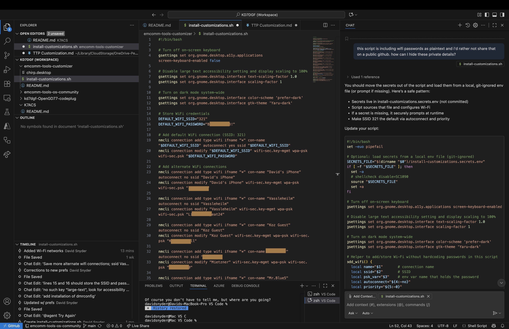

# Creating Your Custom EmComm Tools ISO with AI Assistance

> **For Absolute Beginners:** This guide walks you through using GitHub Copilot and prompt engineering to customize the EmComm Tools Community (ETC) operating system for your own needs. No coding experience required—just follow along!

---

## What Is This Project?

This project helps you create a **custom Ubuntu-based ISO** for emergency communications (EmComm) by amateur radio operators. The ISO is built using **Cubic** (a GUI tool for customizing Ubuntu) and contains:

- **Pre-configured WiFi networks** (your home network, mobile hotspot, etc.)
- **Ham radio software** (CHIRP, dmrconfig, flrig, etc.)
- **APRS/digital mode apps** (direwolf, YAAC, Pat/Winlink)
- **Automatic settings** (dark mode, accessibility, desktop shortcuts)
- **Your callsign and preferences** baked into the ISO

**Key Concept:** This is a **single-user ISO build**—you can safely include your personal WiFi credentials, callsign, and preferences directly in the ISO because it's built for YOUR use, not mass distribution.

### About EmComm Tools Community (ETC)

This customizer is built upon the outstanding work of **TheTechPrepper** and the **EmComm Tools Community** project:

- **Project Homepage:** [EmComm Tools Community](https://community.emcommtools.com/)
- **GitHub Repository:** [emcomm-tools-os-community](https://github.com/thetechprepper/emcomm-tools-os-community)
- **Creator:** TheTechPrepper (YouTube: [@TheTechPrepper](https://www.youtube.com/@TheTechPrepper))

**EmComm Tools Community** is a turnkey, Ubuntu-based operating system specifically designed for amateur radio emergency communications. It comes pre-configured with:

- **Digital Mode Software:** Pat (Winlink), direwolf (packet/APRS), JS8Call, WSJT-X
- **Radio Control:** flrig, Hamlib, rigctld
- **APRS Tools:** YAAC, Xastir
- **Logging:** CQRLOG, PyQSO
- **Offline Documentation:** Mirrored websites and manuals for field use
- **User-Friendly Setup:** `et-user`, `et-radio`, `et-mode` configuration tools
- **Single-User Focus:** Designed for individual operators, not multi-user systems

**All credit goes to TheTechPrepper** for creating this incredible foundation. This customizer project simply adds personal automation scripts to further customize the ETC base system for individual deployments. If you use this project, **please support the upstream ETC project** through:

- Their [community forums](https://community.emcommtools.com/)
- TheTechPrepper's [YouTube channel](https://www.youtube.com/@TheTechPrepper)
- Contributing to the [GitHub repository](https://github.com/thetechprepper/emcomm-tools-os-community)
- Spreading the word in the amateur radio community

**Why Customize ETC?**

While ETC provides an excellent out-of-the-box experience, you may want to:
- Add your own WiFi credentials during the build (avoid manual setup)
- Pre-configure specific radio models and interfaces (Digirig, SignaLink, etc.)
- Install additional tools not in the base image
- Set desktop preferences (dark mode, scaling, keyboard shortcuts)
- Include callsign and grid square in the ISO

This project shows you how to use **AI assistance (GitHub Copilot)** to create those customizations **during the ISO build** (using Cubic), resulting in a truly personalized emergency communications system ready to deploy.

---

## How This Project Works

### Cubic vs. Post-Install Scripts

**IMPORTANT:** Most customizations should happen **during the ISO build** (Cubic), not after installation.

| **Cubic Scripts** (`cubic/` folder) | **Post-Install Scripts** (`post-install/` folder) |
|--------------------------------------|---------------------------------------------------|
| Run DURING ISO creation in Cubic chroot | Run AFTER ETC is installed on target system |
| Can include user-specific data (WiFi, callsign) | Only for hardware-specific detection |
| Install packages, configure apps, set defaults | Interactive wizards, runtime detection |
| **PREFERRED for almost everything** | **RARELY USED** (only edge cases) |

**Example Cubic Scripts:**
- `install-ham-tools.sh` - Installs CHIRP, dmrconfig, flrig
- `configure-wifi.sh` - Configures WiFi from `secrets.env`
- `configure-aprs-apps.sh` - Sets up direwolf, YAAC, Pat
- `setup-desktop-defaults.sh` - Dark mode, accessibility, themes

**Example Post-Install Scripts:**
- GPS auto-detection (hardware varies)
- Radio model detection (runtime only)

**Rule of Thumb:** If it CAN be done in Cubic, it SHOULD be done in Cubic!

---

- **Copilot Free Tier Limits:**  
  - 50 agent/chat requests per month  
  - 2,000 code completions per month  
  Use your requests wisely—Copilot can exhaust its free tier quickly if you experiment a lot.

- **Security and Privacy:**
  - **Never commit secrets** like WiFi passwords to public repositories
  - Always use the secrets management system for sensitive data
  - Keep your `secrets.env` file local only - transfer directly to target systems
  - The `.gitignore` file protects against accidental commits

- **Understand Before You Use:**  
  - Always read and understand Copilot's output before running or sharing code.
  - Don't blindly copy-paste code—review for security, privacy, and correctness.
  - If you're unsure, ask Copilot to explain what the code does.

- **GitHub Repositories Extension:**
  - Works in a "virtual workspace" - no local git repository needed
  - Perfect for beginners - avoids git complexity
  - Keep sensitive files outside the virtual workspaces. If you know better than anything I'm saying, then you're not quite the audience I'm writing for, but I'm open to any suggestions for improvement.

---

## Step-by-Step Guide

### 1. Sign Up for GitHub and Create a Repository

- Go to [GitHub](https://github.com/) and sign up for a free account if you don’t have one.
- Click **New Repository** and follow the prompts to create a project folder.
  - If you’re including private data, make the repository private.
  - Public repositories help the community learn from your work.
- Enable GitHub Copilot (free tier) in your account settings.

### 2. Download and Install VS Code

- Download [VS Code](https://code.visualstudio.com/download) for your operating system (Windows, macOS, or Linux).
- VS Code is a free, full-featured Integrated Development Environment (IDE) from Microsoft. Think of it as adding spell check and grammar check features to Notepad. 

### 3. Install Essential Extensions in VS Code

Open VS Code and install these extensions for a better scripting experience:

- [GitHub Repositories](https://marketplace.visualstudio.com/items?itemName=GitHub.remotehub)
- [GitHub Copilot](https://marketplace.visualstudio.com/items?itemName=GitHub.copilot)
- [GitHub Copilot Chat](https://marketplace.visualstudio.com/items?itemName=GitHub.copilot-chat)
- [IntelliCode](https://marketplace.visualstudio.com/items?itemName=VisualStudioExptTeam.vscodeintellicode)
- [Intellicode API Usage Examples](https://marketplace.visualstudio.com/items?itemName=VisualStudioExptTeam.intellicode-api-usage-examples) (Optional, might be helpful someday)
- [ShellCheck](https://marketplace.visualstudio.com/items?itemName=timonwong.shellcheck)
- [Python](https://marketplace.visualstudio.com/items?itemName=ms-python.python)
- [YAML](https://marketplace.visualstudio.com/items?itemName=redhat.vscode-yaml)
- [XML](https://marketplace.visualstudio.com/items?itemName=redhat.vscode-xml)
- [JSON Editor](https://marketplace.visualstudio.com/items?itemName=nickdemayo.vscode-json-editor)
- [Rainbow CSV](https://marketplace.visualstudio.com/items?itemName=mechatroner.rainbow-csv)
- [GitHub Markdown Preview](https://marketplace.visualstudio.com/items?itemName=bierner.github-markdown-preview)
- [Markdown All in One](https://marketplace.visualstudio.com/items?itemName=yzhang.markdown-all-in-one)
- [Paste Image](https://marketplace.visualstudio.com/items?itemName=mushan.vscode-paste-image)
- [PowerShell](https://marketplace.visualstudio.com/items?itemName=ms-vscode.PowerShell) (Only needed if you're also scripting for Windows)

### 4. Connect VS Code to Your GitHub Repository

- Click the **GitHub Repositories** icon in the VS Code sidebar.
- Sign in to GitHub when prompted.
- Browse your repositories and click **Open** on the one you created.
- VS Code will open your repo in a "virtual workspace"—you can now edit, commit, and push changes directly.

*Note: This method is recommended for beginners as it avoids the confusion of manual cloning and setup. All Git operations can be performed within VS Code's interface. However, use of a local secrets file requires using cloning the repo instead.*

### 5. Install MCP Servers for VS Code

Model Context Protocol (MCP) servers allow AI models like Copilot to interact with files, databases, and APIs directly in VS Code.

- Only install MCP servers from trusted sources!
- Visit [the MCP registry](https://github.com/mcp?utm_source=vscode-website&utm_campaign=mcp-registry-server-launch-2025) and install as needed.
- Recommended: Markitdown, GitHub, Microsoft Learn, DeepWiki.

### 6. Start Using GitHub Copilot for Bash Scripting

- Click the **Settings** gear in the lower left of VS Code and sign into GitHub.
- Open a new file (e.g., `install-customizations.sh`).
- Use **GitHub Copilot Chat** (`Cmd+I` or via the sidebar) to ask for help writing your script.
- Example:  
  `Write a bash script that disables the on-screen keyboard, enables dark mode, and configures Wi-Fi.`


- Refine your script by prompting Copilot for improvements, logging, or troubleshooting. In the example shown, I've asked Copilot how to hide my Wi-Fi passwords.
- **Tip:** Use the [ShellCheck](https://marketplace.visualstudio.com/items?itemName=timonwong.shellcheck) extension to lint your Bash scripts for errors and best practices.
  


### 6.1. Managing Sensitive Information (WiFi Passwords)

**Important:** Never commit WiFi passwords or other secrets to public repositories!

This project uses a **secrets management system**:

1. **Create a secrets template** (`secrets.env.template`):
   - Contains placeholder values that can be safely committed to GitHub
   - Uses identifier-based format: `WIFI_SSID_PRIMARY`, `WIFI_SSID_MOBILE`, etc.

2. **Create your local secrets file**:
   - **Using GitHub Repositories Extension:** Right-click `secrets.env.template` → Copy → Paste → Rename to `secrets.env`
   - **Save this file locally** (outside the virtual workspace)
   - Fill in your actual WiFi credentials

3. **Configure WiFi networks** (add as many as needed):
   ```bash
   # WiFi Network 1 - Primary
   WIFI_SSID_PRIMARY="YourNetworkName"
   WIFI_PASSWORD_PRIMARY="YourPassword"
   WIFI_AUTOCONNECT_PRIMARY="yes"

   # WiFi Network 2 - Mobile hotspot
   WIFI_SSID_MOBILE="YourPhoneHotspot"  
   WIFI_PASSWORD_MOBILE="YourHotspotPassword"
   WIFI_AUTOCONNECT_MOBILE="no"  # Don't auto-connect to mobile
   
   # Add more as needed - script auto-detects all WIFI_SSID_* entries
   # WIFI_SSID_BACKUP="BackupNetwork"
   # WIFI_PASSWORD_BACKUP="BackupPassword"
   # WIFI_AUTOCONNECT_BACKUP="yes"
   ```

4. **The script automatically detects** all configured networks by scanning for `WIFI_SSID_*` entries (no fixed count needed)

5. **Deploy securely**: Copy your local `secrets.env` directly to the target Ubuntu system

### 7. Save Your Script to the Repository

Once you are happy with your new script:

1. **Save the file** in VS Code (e.g., `install-customizations.sh`).
2. In the **Source Control** panel (left sidebar), you should see your changes listed.
3. Enter a commit message like `Add initial install-customizations.sh script`.
4. Click the checkmark to commit.
5. Click the "..." menu or use the Source Control panel to **Push** your changes to GitHub.

Your script is now safely stored in your repository and can be accessed or shared as needed.

### 8. Testing and Deployment

> **💡 Learning Example**
> 
> **I originally wrote this point as...**  
> *Do I run my script in Cubic or after I install ETC? 
> *I don't have a clue, but I'm sure Copilot knows the right answer.*  
> 
> **But on the next run Copilot updated it with the following section.**

**When to run your script:**
- **After installing ETC** (Emergency Tools Community) on the target Ubuntu system
- The script configures user settings, WiFi, and installs additional tools
- **Do NOT run during ISO creation** (Cubic) - this is for post-installation customization

**Deployment process (Ventoy-first workflow):**
1. Install Ventoy on a USB drive (one-time) using the official installer ([ventoy.net](https://www.ventoy.net/en/doc_start.html)).
2. After generating your custom ISO, mount the Ventoy data partition (typically `/media/$USER/Ventoy`) and copy the ISO onto it. Use the helper script to auto-detect Ventoy or copy manually:
  ```bash
  # Helper script (auto-detects Ventoy mount)
  ./copy-iso-to-ventoy.sh ~/etc-builds/<release-tag>/<release-tag>.iso

  # Manual copy (if you prefer specifying the mount path)
  cp ~/etc-builds/<release-tag>/<release-tag>.iso /media/$USER/Ventoy/
  sync
  ```
3. Safely eject the Ventoy drive, boot your target system from it, and select the new ISO from Ventoy's menu to install ETC.
4. Copy your local `secrets.env` to the installed system alongside `install-customizations.sh`.
5. Make the script executable: `chmod +x install-customizations.sh`
6. Run the script: `./install-customizations.sh`

### 9. Radio Configuration Reference

This customizer is configured for **VHF/UHF digital operations** (2m, 1.25cm, 70cm bands) using modern digital modes optimized for local and regional emergency communications.

**Your Primary Setup:**

**DMR (Digital Mobile Radio)** - Anytone D578UV

- Mode: 12.5 kHz narrowband digital (modern, efficient)
- Tools: CHIRP (Windows programming), dmrconfig (native Linux support)
- CAT Control: Full frequency/mode control via Digirig Mobile + hamlib/rigctld
- Networks: Local repeaters, PNWDigital, SeattleDMR statewide
- Advantage: Modern protocol, good coverage, reliable in field conditions

**VARA FM over VHF/UHF** - Pat Winlink client

- Mode: High-speed digital modulation over standard 2m/70cm FM
- Tools: Pat (Winlink email client), VARA FM codec (installed via .wine backup)
- Hardware: Anytone D578UV + Digirig Mobile
- Use Case: Emergency email via internet-connected gateway (when available)
- Speed: 2400 bps (much faster than traditional HF ARDOP)
- Benefit: Works on VHF/UHF where reception is typically better than HF

**AX.25 Packet Radio** - Bluetooth TNC (portable)

- Mode: Traditional packet radio protocol (lightweight, proven)
- Tools: direwolf (TNC emulation), YAAC or APRS clients
- Interface: Bluetooth TNC (e.g., WA5DJJ) for laptop field operations
- Use Case: APRS position reporting, keyboard-to-keyboard digital QSOs, packet network
- Advantage: Portable setup, no USB cables, works with any FM radio
- Ideal for: Emergency responders with mobile laptops

**Why This Focus (VHF/UHF Only)?**

Optimized for **local/regional emergency communications**:

- More reliable in urban/mountainous terrain (shorter wavelengths penetrate better)
- Faster setup—no antenna tuning, just power on and go
- Works indoors and in Faraday cage environments where HF doesn't
- Better for field operations—portable 2m rig vs. heavy HF transceiver
- Lower power consumption (critical for battery-powered field deployments)
- Faster digital speeds via VARA FM (2400 bps vs. 300-1200 bps HF ARDOP)

**Future HF Expansion (Optional):**

The system architecture supports HF transceivers if needed. To add HF capabilities:

1. Add CAT control for your HF radio (FT-897D, etc.) via Digirig or USB interface
2. Install fldigi or JS8Call for HF digital modes
3. Configure Pat for HF ARDOP mode (slower, but long-distance capable)
4. Add separate frequency allocations in CHIRP/dmrconfig

But for now, **VHF/UHF is the primary focus** of this customizer.

### 10. Documenting Your Customizations

Good documentation helps you remember your choices and helps others learn from your work. You can generate professional documentation using Copilot:

#### Why Use Markdown for Documentation?

Markdown is a lightweight markup language that makes it easy to format text using simple symbols. It's the standard for GitHub and technical documentation because:

- **Readability:** Easy to read in plain text, renders beautifully on GitHub
- **Portability:** Supported everywhere (GitHub, VS Code, documentation sites)
- **Version Control Friendly:** Works perfectly with Git—track changes easily
- **Simplicity:** Just a few symbols for headings, lists, links, and images

#### Creating Documentation with Copilot

1. **Ask Copilot Chat:**

   - Open a new file named `README.md`
   - Prompt Copilot:

   ```text
   Generate a README for this EmComm Tools customization project.
   Include:
   - Project overview
   - Prerequisites (Cubic, Ubuntu, secrets.env)
   - Installation/build instructions
   - Usage examples
   - Troubleshooting tips
   - Radio compatibility notes
   ```

2. **Use VS Code Extensions for Markdown:**  
   - [Markdown All in One](https://marketplace.visualstudio.com/items?itemName=yzhang.markdown-all-in-one) - Auto-formatting, table of contents
   - [GitHub Markdown Preview](https://marketplace.visualstudio.com/items?itemName=bierner.github-markdown-preview) - Preview as GitHub renders it
   - [Paste Image](https://marketplace.visualstudio.com/items?itemName=mushan.vscode-paste-image) - Easy screenshot insertion

3. **Document Your Customizations:**
   - Explain WHY you made each change (not just WHAT)
   - Include hardware notes (which radios you're using)
   - Add troubleshooting tips from your experience
   - Link to upstream projects and resources

#### Example Documentation Structure

```markdown
# My Custom EmComm Tools ISO

## Overview
Custom ISO based on EmComm Tools Community for [Your Location] EmComm operations.

## Hardware Configuration
- Radio: Anytone D878UV
- Interface: Digirig Mobile
- Computer: [Your laptop model]

## Customizations
- WiFi: Home network, mobile hotspot, EOC network
- APRS: iGate mode with direwolf
- Callsign: KD7DGF
- Apps: CHIRP, flrig, Pat (Winlink)

## Build Instructions
1. Install Cubic on Ubuntu system
2. Clone this repository
3. Copy secrets.env from secure location
4. Run: ./build-etc-iso.sh
5. Result: Custom ISO in Cubic output folder

## Radio Setup Notes
Digirig Mobile provides full CAT control (not just VOX):
- /dev/ttyUSB0 = Audio codec
- /dev/ttyUSB1 = CAT serial
- Use flrig for frequency control
- Configure apps to use flrig XML-RPC on port 12345

## Troubleshooting
[Your specific issues and solutions]

## Credits
- Upstream: EmComm Tools Community (https://community.emcommtools.com/)
- Digirig: https://digirig.net/
- Built with AI assistance: GitHub Copilot
```

#### Image Best Practices

- **Storage:** Keep images in `images/` folder
- **Naming:** Use descriptive names: `digirig-connection.jpg`, not `IMG_1234.jpg`
- **Sizing:** Resize before adding (don't just scale in Markdown)
- **Formats:** Use JPG for photos, PNG for screenshots
- **Privacy:** Blur sensitive info (callsigns, passwords, locations) if sharing publicly

**Preview Markdown:** Press `Cmd+Shift+V` (Mac) or `Ctrl+Shift+V` (Windows/Linux) in VS Code

---

---

## Copilot Free vs. Pro

- **Free Tier:**  
  - 50 agent/chat requests per month  
  - 2,000 code completions per month  
  - Great for occasional use and learning, but easy to exhaust if you experiment a lot.

- **Pro Upgrade ($10/month):**  
  - Unlimited Copilot Chat and code completions.
  - Priority access to new features and models.
  - Recommended if you use Copilot regularly or for professional work.

---

## GPT vs. Claude: Choosing Your AI Assistant

- **GitHub Copilot** uses OpenAI's GPT models (like GPT-4), which are highly capable for code generation, explanations, and refactoring.
- **Claude** (by Anthropic) is another advanced AI assistant, available in some editors and platforms.
- **Key Differences:**
  - GPT models are deeply integrated with GitHub and VS Code, with strong code context and completion abilities.
  - Claude is known for longer context windows and a more conversational style, but may not be as tightly integrated with coding tools.
- **Tip:** Try both if available—choose the one that best fits your workflow and project needs.

---

## Important Warnings for Beginners

- **Copilot Free Tier Limits:**  
  - 50 agent/chat requests per month  
  - 2,000 code completions per month  
  Use your requests wisely—Copilot can exhaust its free tier quickly if you experiment a lot.

- **Understand Before You Use:**  
  - Always read and understand Copilot’s output before running or sharing code.
  - Don’t blindly copy-paste code—review for security, privacy, and correctness.
  - If you’re unsure, ask Copilot to explain what the code does.

---

## Final Advice

- Take your time to learn each tool.
- Use Copilot as a helper, not a replacement for understanding.
- Keep your scripts and documentation private if they contain sensitive information.
- Share your work to help others, but always review for secrets before publishing.

---
